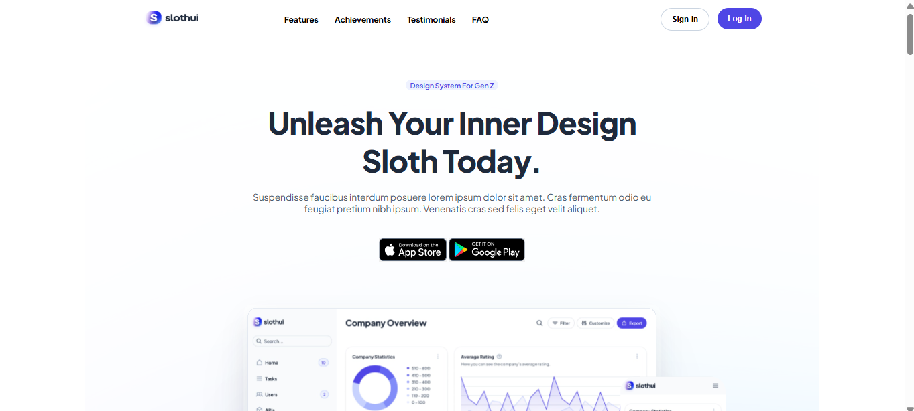

# SlothUI



SlothUI is a modern, responsive UI template that provides clean and stylish components for web projects. Built with HTML, CSS, and JavaScript, it offers a smooth and visually appealing user experience.

## 🚀 Live Demo

[🔗 SlothUI Live](https://mrashed21.github.io/slothui/)

## 📂 Features

- 💡 **Responsive Design** – Fully optimized for mobile and desktop devices.
- 🎨 **Modern UI Components** – Clean and stylish interface.
- ⭐ **Testimonials Section** – Includes "Load More" functionality on mobile.
- ⚡ **Lightweight & Fast** – Optimized for performance.
- 📜 **Easy to Customize** – Well-structured and clean code.

## 🛠 Tech Stack

- **HTML5**
- **CSS3**
- **JavaScript (ES6+)**

## 📥 Installation

To run the project locally, follow these steps:

```sh
git clone https://github.com/mrashed21/slothui.git
cd slothui
```

Simply open `index.html` in your browser to preview the project.

## 📞 Contact

If you have any questions or suggestions, feel free to reach out:

- **GitHub:** [mrashed21](https://github.com/mrashed21)
- **Email:** rashedjaman768@gmail.com
